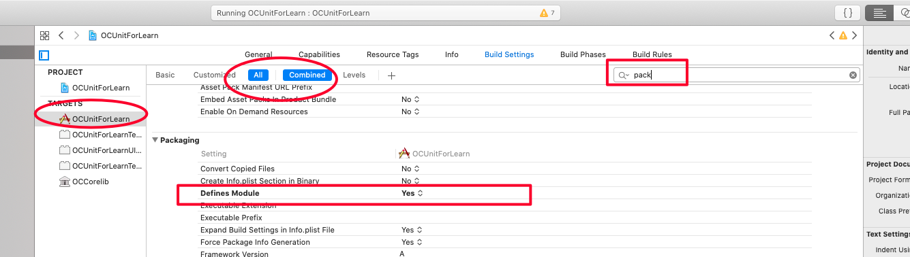
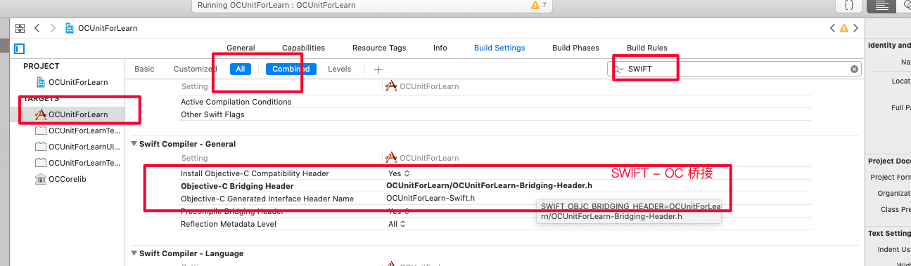
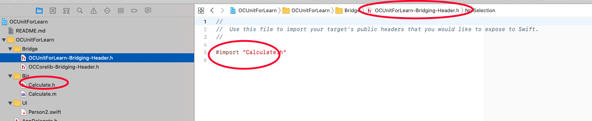
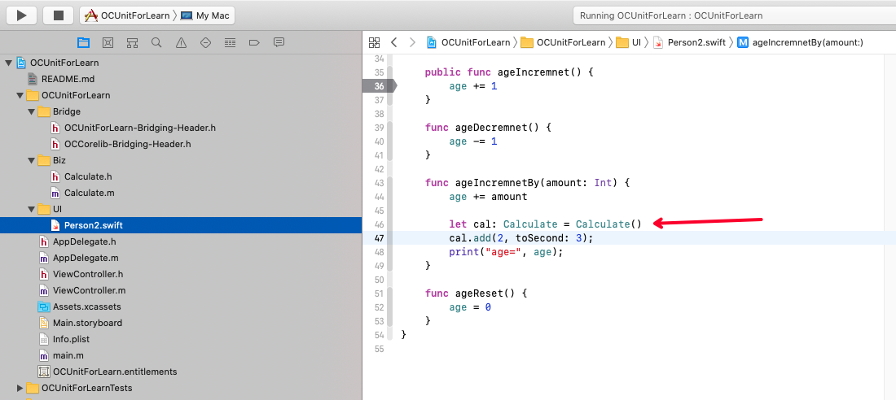
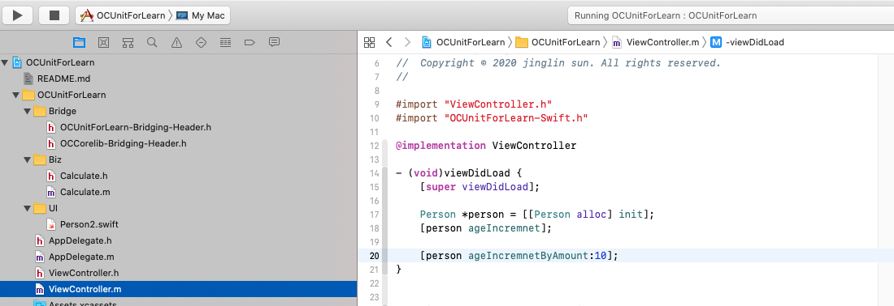
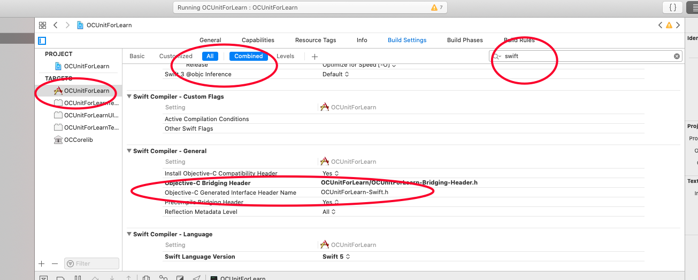
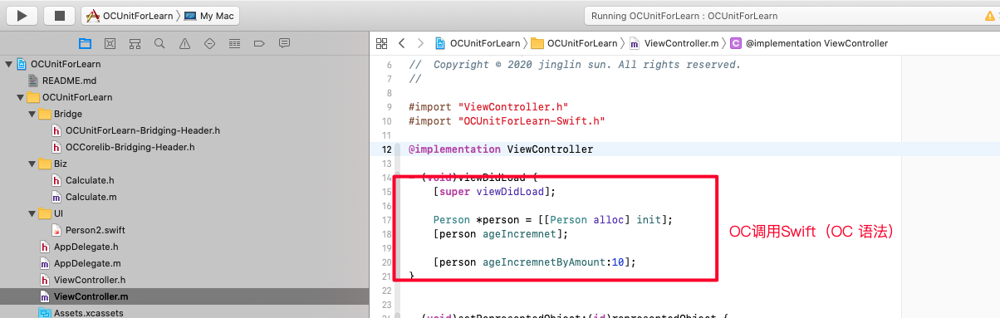

#1.Swift 调用 OC

##1. 创建Swift-OC桥接文件
*桥接文件命名规则：Target名称--Bridging-Header.h

*首次创建swfit文件的时候，系统自动提示桥接文件。如果所示

*桥接文件的相关Building Setting

##2. 桥接文件里面，导入OC类的头文件

##3. Swfit 直接调用用OC

#2.OC 调用 Swfit

##1. 针对要使用Swift的OC文件，导入OC-Swift桥接文件。
*桥接文件命名规则：Target名称--Swfit.h

文件的配置，查看Target设置

##2.OC 直接调用 Swift

